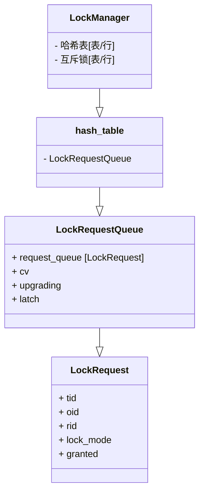

# Preview

二阶段锁：

- Growing

​		该阶段只能加锁，不能解锁

- Shrinking

​		该阶段只能解锁，不能加锁


### 隔离级别

四种隔离等级

- **READ_UNCOMMITED 读未提交** 

​		为了避免脏写，加X锁，读不加锁，每次读最新数据记录。 **（存在脏读问题）**

​		在这种隔离级别下，查询是不会加锁的，也由于查询的不加锁，所以这种隔离级别的一致性是最差的，可能会产生“脏读”、“不可重复读”、“幻读”。如无特殊情况，基本是不会使用这种隔离级别的。

- **READ_COMMITED 读提交**

​		加S锁，每次读完立即释放。 **（strict-2PL）**

​		若有事务对数据进行更新（UPDATE）操作时，读操作事务要等待这个更新操作事务提交后才能读取数据，可以解决脏读问题。出现了一个事务范围内两个相同的查询却返回了不同数据，这就是不可重复读。

- **REPEATABLE_READ 可重复读**

​		加S锁，在事务提交/中止时由TransactionManager统一释放 **（rigorous-2PL）**

​		重复读可以解决不可重复读问题。不可重复读对应的是修改，**即UPDATE操作**。但是可能还会有幻读问题。因为幻读问题对应的是插入INSERT操作，而不是UPDATE操作。

- **SERIALIZABLE 串行化**

| 隔离级别 |  脏读  | 不可重复读 |  幻读  |
| :------: | :----: | :--------: | :----: |
| 读未提交 |  可能  |    可能    |  可能  |
|  读提交  | 不可能 |    可能    |  可能  |
| 可重复读 | 不可能 |   不可能   |  可能  |
|  串行化  | 不可能 |   不可能   | 不可能 |

**问题：**

- 脏读

​		指当一个事务正在访问数据，并且对数据进行了修改，而这种数据还没有提交到数据库中，这时，另外一个事务也访问这个数据，然后使用了这个数据。因为这个数据还没有提交那么另外一个事务读取到的这个数据我们称之为脏数据。依据脏数据所做的操作可能是不正确的。

- 不可重复读

​		指在一个事务内，多次读同一数据。在这个事务还没有执行结束，另外一个事务也访问该同一数据，那么在第一个事务中的两次读取数据之间，由于第二个事务的修改第一个事务两次读到的数据可能是不一样的，这样就发生了在一个事物内两次连续读到的数据是不一样的，这种情况被称为是不可重复读。

- 幻读

​		一个事务先后读取一个范围的记录，但两次读取的纪录数不同，我们称之为幻读（两次执行同一条 select 语句会出现不同的结果，第二次读会增加一数据行，并没有说这两次执行是在同一个事务中）

不同数据库处理隔离等级内容不相同

# Task1

## LockTable()

整个``LockTable()``流程图如下所示：


仔细阅读``lockmanager.h``中的提示**[LOCK_NOTE]**,可以确定三种隔离等级需要满足的条件，如果不满足则要置**TransactionState**为**abort**状态

### 查找加锁页面

接下来就要对锁表进行操作了，在操作锁表之前要先将整个哈希表上锁，在拿到该txn需要操作的table后再释放锁，过程像P2的螃蟹锁一样，先锁table，再释放哈希表锁

确定了需要操作的**table**后，下一步就是拿到该**table**的**request_queue**，**request_queue**里存的是该**table**所被请求的锁队列，总的数据结构如下



**request_queue**为一个队列，存放着加在该表（行）的锁请求，其中**tid**为事务id，**oid**为表id，**rid**为行id（在表锁中不需要）,**lock_mode**为要加锁的模式，**granted**为布尔变量，标志着该锁是否被授予

如果需要加锁的页面没有**request**则新建**request**请求，至此，查找加锁页面结束

### 判断新旧事务

拿到该**table**的**request_queue**后，遍历整个队列

- 如果**request**中没有改事务存在（该事务为新事务），则直接将该请求放到队尾，通过条件变量模型等待锁授权

- 如果**request**中已经有该事务存在，则进行**锁升级**的判断：

如果原锁模式与该锁模式相同，则不需要加锁，因为已经有这把锁了，**直接return true**

如果原锁模式与该锁模式不同，则需要先判断是否已经有锁在升级，**LockRequestQueue**中**upgrading**标记着请求队列中正在升级的事务id，若无锁升级，则**upgrading**的值为**INVALID**，存在其他正在升级的锁时，该事务置为**ABORT**；无其他正在升级的锁时，判断当前锁模式是否满足升级条件，锁升级条件在**[LOCK_NOTE]**中可以看到

```
   *        IS -> [S, X, IX, SIX]
   *        S -> [X, SIX]
   *        IX -> [X, SIX]
   *        SIX -> [X]
```

若满足升级条件，则对该锁进行升级：

升级需要先将原锁请求从队列中删除，再创建一个新加锁请求，让新加锁请求成为第一个未授权锁（升级锁拥有高权限），方法是遍历整个**request_queue**，找到第一个**granted 为 false**的位置，将新请求插入该位置即可，最后要更新**upgrading**，标记为正在升级状态,防止多个锁同时进行升级

升级完成后，通过条件变量模型等待锁授权

### *条件变量

条件变量并不是某一个特定语言中的概念，而是操作系统中线程同步的一种机制。条件变量经典的使用形式：

```c++
std::unique_lock<std::mutex> lock(latch);
while (!resource) {
    cv.wait(lock);
}
```

条件变量与互斥锁配合使用。首先需要持有锁，并查看是否能够获取资源。这个锁与资源绑定，是用来保护资源的锁。若暂时无法获取资源，则调用条件变量的 wait 函数。调用 wait 函数后，latch 将自动**释放**，并且当前线程被挂起，以节省资源。这就是阻塞的过程。此外，允许有多个线程在 wait 同一个 latch。

当其他线程的活动使得资源状态发生改变时，需要调用条件遍历的 `notify_all()` 函数。

```c++
cv.notify_all();
```

`notify_all()` 可以看作一次广播，会唤醒所有正在此条件变量上阻塞的线程。在线程被唤醒后，其仍处于 wait 函数中。在 wait 函数中尝试获取 latch。在成功获取 latch 后，退出 wait 函数，进入循环的判断条件，检查是否能获取资源。若仍不能获取资源，就继续进入 wait 阻塞，释放锁，挂起线程。若能获取资源，则退出循环。这样就实现了阻塞等待资源的模型。条件变量中的条件指的就是满足某个条件，在这里即能够获取资源。

理解条件变量的作用后，就可以写出如下代码：

```c++
std::unique_lock<std::mutex> lock(queue->latch_);
while (!GrantLock(...)) {
    queue->cv_.wait(lock);
}
```

``GrantLock()``函数中，会判断出事务是否可以成功获取锁，授予锁的条件为：

1. 前面事务都兼容
2. 遵循FIFO，只有当前事务未第一个未授予的锁

## UnlockTable()

怎么加的锁就怎么去解锁，流程如下：


## LockRow()

与``LockTable()``基本相同

- 不支持意向锁（只允许S/X锁）
- 加锁时需要判断表的锁状态
- 其他流程类似

## UnLockRow()

与``UnLockTable()``相同

# Task2

后台线程，中止阻塞的事务

要求我们动态构建有向图，不需要长久维护一个图，可以从题目中给到的API入手

``AddEdge()``、``RemoveEdge()``、``GetEdgeList()``都是比较简单的增边删边操作，用来构建有向图，**点代表事务**ID，**边代表依赖关系**，指向被依赖的事务

重要逻辑在``HasCycle()``、``RunCycleDetection()``中


## 建图

``T1->T2``代表T1正在等待T2释放资源，哈希表**waits_for_**代表着该事务所等待释放资源的事务合集，根据Lab要求，我们遍历所有页和行的请求队列，**已经被授予的锁作为箭头所指向的点**，waiting中的事务将作为出发点建边。

## 判环

构建完图之后，我们选择DFS进行环检测，要求保证搜索的确定性（不理解），应该就是遍历的顺序要从tid小的事务开始搜索，选择其邻居的过程也要优先最小的tid，若存在环，则挑选合适（youngest，即TID最大）的事务进行中止

中止之后，需要在请求队列中移除事务，释放该事务所持有的所有锁，并通知正在阻塞的相关事务。不要忘记修改**waits_for_**，因为有可能存在多个环，需要在死锁检测线程结束时打破所有环。

难度不大，主要内容在DFS中

# Task3

将P3实现的执行算子中``SeqScan``、``Insert``、``Delete``三个算子实现可并发操作

其中``SeqScan``代表读，``Insert``、``Delete``则代表写

## 读

**SeqScan**在表中加IS锁，在行中加S锁，表锁可以在``Init()``函数中实现，行锁的加锁和释放则在对应读取数据时进行即可

## 写

与**SeqScan**类似，IX锁在``Init()``函数中实现，行锁在``Next()``中实现，要注意的是**Insert**和**Delete**的加锁顺序不同，**Insert**是插入完成再加锁，**Delete**则是先加锁，再进行删除操作，两个写算子都不需要释放锁，锁会在COMMIT的时候进行释放

# Leaderboard Task

看都没看，最近太忙，有空再来挑战一下！
